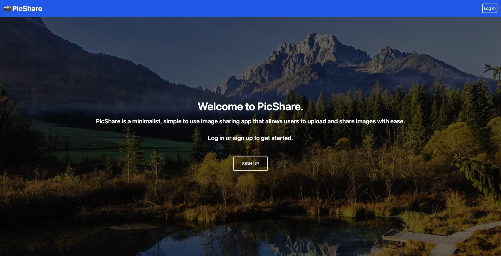

# PicShare
A minimalistic picture-sharing application.

## The Project
We set out to build an image sharing app with a focus on minimalism which was reminiscent of the days before ads and targeted algorithms.

---
## Table of Contents
[User Stories](#user-stories)<br>
[Functionality](#functionality)<br>
[Languages Used](#languages-used)<br>
[APIs Used](#apis-used)<br>
[Deployed Application](#deployed-application)<br>
[Links](#links)<br>
[Creators](#creators)<br>

---

## User Stories
```
AS a user
I WANT a simple image sharing app which I can upload media and post comments to
SO THAT I can share my favorite images and posts with other users
```
---

## Functionality
* User is able to create and share image posts with user authentication
* User is able to show a gallery of a user’s collected images
* User is able to comment on other user’s image posts
* User is able to create an account or log into an existing account

---
## Languages Used
* Node.js & Express.js to create RESTful API
* Handlebars for HTML templates
* MYSQL and Sequelize for database
* Deployed via Heroku
* Cloudinary Media Upload
* Tailwind CSS for styling

---

## APIs Used

### [Cloudinary](https://cloudinary.com/documentation/upload_widget) <br>

---
## Deployed Application


---

### Links
[Project GitHub Repo](https://github.com/nugemeister/PicShare) <br>
[Deployed Project on Heroku](https://nugemeister-picshare.herokuapp.com/) <br>

---
### Creators
[Ali](https://github.com/nugemeister), [Colin](https://github.com/cplancich), and [Connor](https://github.com/cmullan602)

